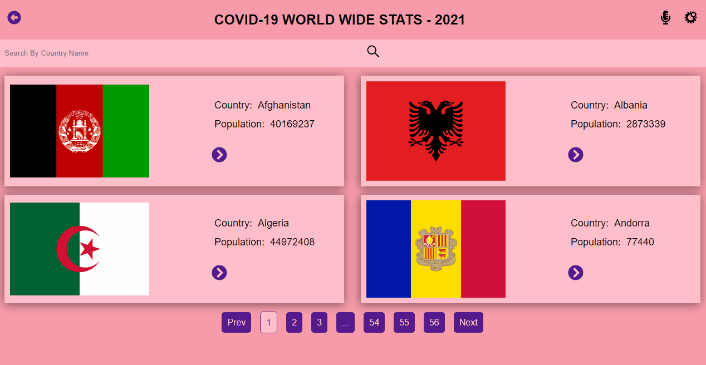

# REACT CAPSTONE - COVID-19 TRACKER
This project is a single page application (SPA) built with React and Redux.
The data retrieved from the API is stored in the Redux store and then filtered using a Filter stateless component.
Every page (the home page and the details for each country) has a unique route within the SPA.
The project is deployed using Heroku and is accessible online


## Live Page and Loom presentation
- [Covid-19 Tracker](https://tracker-covid-19-2021.herokuapp.com/)
- [Presentation](https://www.loom.com/share/4dc304140b27489c978c2585152a0154)

## Preview App

- 

## Built With

- ### Major languages
  - Javascript, CSS
- ### Frameworks
  - ReactJS, Redux, React-Redux, React Bootstrap, Heroku
- ### Technologies used
  - Webpack, Babelrc, Linters


## Getting Started

To get a local copy up and running follow these simple example steps.

### Prerequisites

- VS Code
- Chrome Browser
- Gitbash


### Usage
- To get local copy :
 ``` node
  git clone https://github.com/Kingstalux/    React-capstone
  ```
 ```node
   cd react-capstone
 ```
  ```node
   code .
 ```
  ```node
   npm install
 ```
 - To open in browser using webpack server :
  ```node
   npm start
 ```

 ## Testing

To test this project you need to :
``` node
    npm test
```


## Author

👤 **Ngu Kingsely**

- GitHub: [@Kingstalux](https://github.com/Kingstalux)
- Twitter: [@NguKingsley](https://twitter.com/NguKingsley)
- LinkedIn: [Ngu Kingsely](https://www.linkedin.com/in/ngu-kingsely-junior-cho-974b60136/)
## Acknowledgment

Original design idea by Nelson Sakwa on Behance.

## 🤝 Contributing


Contributions, issues, and feature requests are welcome!

Feel free to check the [issues page](https://github.com/Kingstalux/Maths-magicians/issues).

## Show your support

Give a ⭐️ if you like this project!


## 📝 License

This project is [MIT](./MIT.md) licensed.
